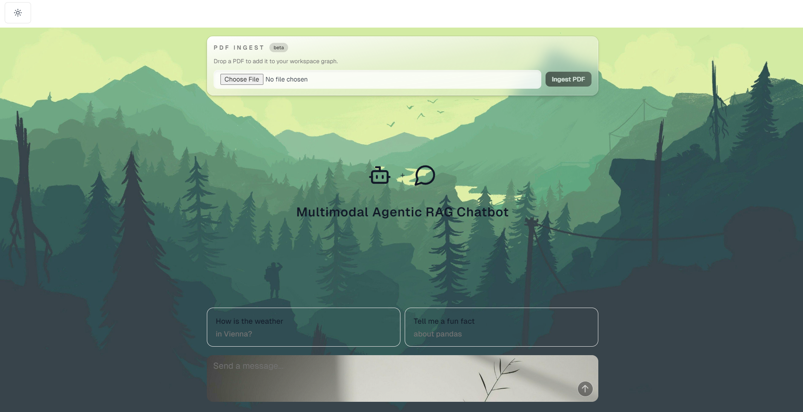

<div align="center">

# 🤖 Agentic RAG System

**Intelligent Document Q&A with Multi-Modal Processing**

[](https://www.python.org/)
[](https://fastapi.tiangolo.com/)
[](https://reactjs.org/)
[](https://www.typescriptlang.org/)

*A powerful Retrieval-Augmented Generation system that transforms PDFs into intelligent knowledge bases*

[Features](#-features) • [Quick Start](#-quick-start) • [Documentation](#-documentation) • [API](#-api-reference)

</div>

---

## 📸 Preview

<div align="center">



*Beautiful, modern chat interface with PDF upload and intelligent Q&A*

</div>

---

## ✨ Features

<div align="center">

| 🎯 **Core Capabilities** | 🚀 **Advanced Features** |
|------------------------|--------------------------|
| 📄 **PDF Processing** | 🔍 **Hybrid Search** (Keyword + Semantic) |
| 🖼️ **Image Extraction** | 🌐 **Web Search Integration** |
| 📊 **Table Analysis** | 💬 **Conversation Memory** |
| 🤖 **Agentic Workflows** | ⚡ **Real-time Responses** |

</div>

### What Makes It Special

- **🎨 Multi-Modal Processing**: Handles text, images, and tables from PDFs
- **🧠 Smart Chunking**: Semantic understanding of document structure
- **🔄 Quality Assurance**: Automatic answer rating and feedback loops
- **🌓 Modern UI**: Beautiful React interface with dark mode
- **⚡ Fast & Scalable**: OpenSearch backend with vector search

---

## 🚀 Quick Start

### Prerequisites

Make sure you have these installed:

- 🐍 Python 3.10+
- 📦 Node.js 18+
- 🐳 Docker & Docker Compose
- 🤖 Ollama (for embeddings)

### Installation (5 minutes)

<details>
<summary><b>1️⃣ Start Infrastructure</b></summary>

```bash
# Start OpenSearch
docker-compose up -d
```

✅ OpenSearch: `http://localhost:9200`  
✅ Dashboards: `http://localhost:5601`
</details>

<details>
<summary><b>2️⃣ Setup Ollama</b></summary>

```bash
# Pull embedding model
ollama pull nomic-embed-text

# Verify it's running
curl http://localhost:11434/api/tags
```
</details>

<details>
<summary><b>3️⃣ Install Backend</b></summary>

```bash
# Create virtual environment
python -m venv .venv
source .venv/bin/activate  # Windows: .venv\Scripts\activate

# Install dependencies
pip install -r requirements.txt
pip install unstructured[pdf] langchain-google-genai langgraph opensearch-py python-dotenv
```
</details>

<details>
<summary><b>4️⃣ Install Frontend</b></summary>

```bash
cd chatbot-ui
npm install
```
</details>

<details>
<summary><b>5️⃣ Configure Environment</b></summary>

Create `.env` in root:
```env
GOOGLE_API_KEY=your_gemini_key
SERPER_API_KEY=your_serper_key
```

Create `.env` in `chatbot-ui/`:
```env
VITE_API_BASE=http://localhost:8000
```
</details>

### 🎮 Run It!

**Terminal 1 - Backend:**
```bash
uvicorn app:app --reload --port 8000
```

**Terminal 2 - Frontend:**
```bash
cd chatbot-ui
npm run dev
```

🎉 Open `http://localhost:5173` and start chatting!

---

## 🏗️ How It Works

```
┌─────────────┐
│  PDF Upload │
└──────┬──────┘
       │
       ▼
┌─────────────────────────────────────┐
│  Extract → Chunk → Embed → Index   │
│  (Text, Images, Tables)             │
└──────┬──────────────────────────────┘
       │
       ▼
┌─────────────┐      ┌──────────────┐
│  OpenSearch │      │   Ollama     │
│  (Storage)  │◄─────│ (Embeddings) │
└──────┬──────┘      └──────────────┘
       │
       │ User Query
       ▼
┌─────────────────────────────────────┐
│  Query Enhancement                  │
│         │                           │
│         ├─► Hybrid Search ──┐       │
│         │                   │       │
│         └─► Web Search ─────┤       │
│                             ▼       │
│                    Summarize & Merge│
│                             │       │
│                             ▼       │
│                    Quality Check    │
│                             │       │
│                    ┌────────┴──┐   │
│                    │ Approved?  │   │
│                    └────┬───────┘   │
│                         │           │
│                    ┌────┴────┐     │
│                    │  Yes    │ No  │
│                    └────┬────┘     │
│                         │          │
│                         ▼          │
│                    Final Answer    │
└─────────────────────────────────────┘
```

---

## 📡 API Reference

### Core Endpoints

#### `POST /ingest`
Upload and process a PDF file.

```bash
curl -X POST http://localhost:8000/ingest \
  -F "file=@document.pdf"
```

**Response:**
```json
{
  "message": "Ingestion started",
  "original_filename": "document.pdf",
  "index": "pdf_content_index"
}
```

#### `POST /query`
Ask questions about your documents.

```bash
curl -X POST http://localhost:8000/query \
  -H "Content-Type: application/json" \
  -d '{"query": "What is this document about?"}'
```

**Response:**
```json
{
  "r_g_summary": "Comprehensive answer based on documents and web search...",
  "rating": "approved",
  "conversation_id": "uuid-here"
}
```

#### `GET /health`
Check service status.

```bash
curl http://localhost:8000/health
```

### Conversation Management

| Endpoint | Method | Description |
|----------|--------|-------------|
| `/conversations/{id}` | GET | Get conversation history |
| `/conversations/{id}` | DELETE | Delete conversation |

---

## 📁 Project Structure

```
langchain_tools/
├── 🚀 app.py              # FastAPI server & endpoints
├── 🔄 workflow_2.py       # Agentic RAG workflow
├── 🤖 agent.py            # LangChain agent with tools
├── 📥 ingestion.py         # PDF → OpenSearch pipeline
├── 🔍 retrieval.py        # Search (keyword/semantic/hybrid)
├── ✨ generation.py       # RAG response generation
├── 📄 chunker.py          # PDF chunking & processing
├── 🛠️ helper.py           # Utilities (embeddings, clients)
├── 📦 requirements.txt    # Python dependencies
├── 🐳 docker-compose.yml  # OpenSearch setup
└── 💻 chatbot-ui/        # React frontend
    ├── src/
    │   ├── pages/chat/   # Chat interface
    │   └── components/   # UI components
    └── package.json
```

---

## 🔧 Key Components

### PDF Processing Pipeline

1. **📄 Partitioning** - Extract text, images, tables using `unstructured`
2. **🖼️ Image Processing** - Generate captions with Gemini Vision
3. **📊 Table Analysis** - Extract and describe table structures
4. **🧩 Semantic Chunking** - Create meaningful text chunks
5. **🔢 Embedding** - Generate 768-d vectors with Ollama
6. **💾 Indexing** - Store in OpenSearch with vector search

### Agentic RAG Workflow

The system uses a sophisticated multi-step workflow:

1. **Query Enhancement** - Improve queries for better retrieval
2. **Parallel Retrieval** - Search documents + web simultaneously
3. **Summarization** - Create concise summaries from both sources
4. **Merging** - Combine document and web knowledge
5. **Quality Rating** - Evaluate answer quality
6. **Feedback Loop** - Re-retrieve if quality is low

### Search Methods

- **🔤 Keyword Search** - Traditional text matching
- **🧠 Semantic Search** - Vector similarity using embeddings
- **⚡ Hybrid Search** - Best of both worlds

---

## 🛠️ Development

### Testing Components

```bash
# Test retrieval
python retrieval.py

# Test generation
python generation.py

# Test workflow
python workflow_2.py "test query"
```

### Frontend Development

```bash
cd chatbot-ui
npm run dev      # Development
npm run build    # Production build
npm run lint     # Code quality
```

### Adding Features

- **New Tools**: Add to `agent.py` tools list
- **Workflow Nodes**: Extend `workflow_2.py` graph
- **Search Methods**: Add functions to `retrieval.py`

---

## ⚠️ Important Notes

> **🔒 Security**: API keys are currently hardcoded. Use environment variables in production.

- OpenSearch index is recreated on each ingestion
- Conversations stored in-memory (not persistent)
- PDFs deleted after processing
- Smalltalk detection for casual greetings

---

## 🤝 Contributing

Contributions welcome! Here's how:

1. 🍴 Fork the repo
2. 🌿 Create a feature branch
3. ✏️ Make your changes
4. ✅ Test thoroughly
5. 📤 Submit a PR

---

## 🙏 Built With

<div align="center">

| Technology | Purpose |
|-----------|---------|
| [LangChain](https://www.langchain.com/) | RAG Framework |
| [OpenSearch](https://opensearch.org/) | Vector Database |
| [FastAPI](https://fastapi.tiangolo.com/) | Backend API |
| [React](https://reactjs.org/) | Frontend UI |
| [Gemini](https://deepmind.google/technologies/gemini/) | LLM & Vision |
| [Ollama](https://ollama.ai/) | Embeddings |
| [Unstructured](https://www.unstructured.io/) | PDF Processing |

</div>

---

<div align="center">

**Made with ❤️ using LangChain and modern AI tools**

⭐ Star this repo if you find it useful!

</div>
